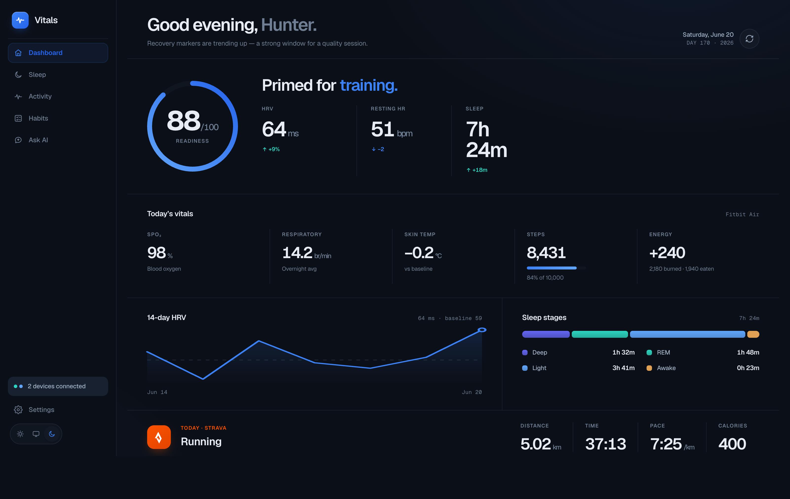
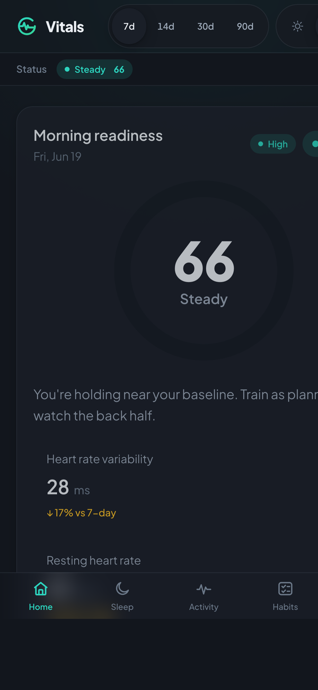

<div align="center">


A self-hosted, privacy-first personal health command center. Vitals unifies every
wearable you own into one daily **readiness** read, gives you an **AI coach**,
and shows a dashboard you fully own — your data in a local SQLite database
that never touches a vendor cloud.

[](LICENSE)
&nbsp;
&nbsp;
&nbsp;
&nbsp;

<br>

**New here?** Go from zero to a fully populated demo dashboard in 5 minutes — no
accounts, no OAuth. See **[docs/QUICKSTART.md](docs/QUICKSTART.md)**.

<br>


<br><br>

<table>
<tr>
<td align="center"><br><sub>Soft Midnight theme</sub></td>
<td align="center"><br><sub>Installable PWA</sub></td>
</tr>
</table>

</div>

---

## Why Vitals

Every wearable wants to be your whole picture, and each one lives in its own
walled-garden app. Vitals takes the opposite stance: pull the numbers out of all
of them, reconcile them into one trustworthy daily read, and keep everything on a
box you control. No subscription, no data broker, no lock-in.

## Features

- **Unify your wearables** — pull Fitbit/Pixel, Oura, WHOOP, and Apple Health
  into one normalized timeline. Multiple devices measuring the same metric are
  reconciled into a weighted **consensus** with a per-metric **confidence** level.
- **Daily readiness** — one friendly read on how recovered you are today, from
  HRV, resting HR, sleep, and skin-temperature trend versus your baseline.
- **Runs & workouts via Strava** — connect Strava (live OAuth) to sync Apple
  Watch / phone runs into your timeline. Click any run for a detail modal with
  splits, laps, segments, and reconstructed run/walk **intervals** (rebuilt from
  the activity's velocity stream).
- **Daily AI brief** — a short, specific morning brief that renders right on the
  dashboard, analyzing your recovery, trends, and recent runs (down to per-mile
  interval paces). Toggle it on/off, auto-generate it, or hit **Regenerate** any
  time. Plus a free-form **Ask** box for one-off questions.
- **Bring your own AI** — the brief and Ask run through a configurable provider
  chain. Use a cloud model or go **100% local** with Ollama / any
  OpenAI-compatible server — no API key, nothing leaves the machine.
- **Calm PWA dashboard** — a React + Vite progressive web app with light and
  dark themes, installable on phone and desktop.
- **Query from Claude** — a built-in **MCP server** lets you ask your own health
  data questions from claude.ai or Claude Desktop (read-only on the public surface).
- **Fully self-hosted & private** — your data lives in a local SQLite file on your
  own always-on box. Remote access is your own private tailnet, not a SaaS.

## Supported sources

Vitals has two kinds of source. **Consensus devices** provide daily vitals +
sleep that get reconciled into one weighted read. **Activity sources** provide
workouts only — they feed the timeline but don't vote in the consensus.

| Source | Kind | How it connects |
|---|---|---|
| **Fitbit / Pixel / Google Health** | Consensus (vitals + sleep) | Google Health API "bridge" (OAuth) — also aggregates other devices that sync to it |
| **Apple Health** | Consensus (vitals + sleep) | [Health Auto Export](https://www.healthexportapp.com/) iOS app → REST ingest (`POST /api/ingest/apple`) |
| **Oura** | Consensus (vitals + sleep) | Oura personal access token (no OAuth) |
| **WHOOP** | Consensus (vitals + sleep) | WHOOP OAuth |
| **Strava** | Activity (workouts only) | Strava OAuth — syncs runs into the `workouts` table with splits/laps/segments and reconstructed run/walk intervals |
| **Garmin & others** | Consensus | Community-extensible via the same adapter pattern |

For consensus devices, a device is sourced **either** from the Google Health
bridge **or** from its native adapter — never both, so nothing is
double-counted. Which devices the bridge owns is set by `GOOGLE_HEALTH_SOURCES`.
See **[docs/ADAPTERS.md](docs/ADAPTERS.md)**.

## Quick start

The fastest path is **seed-first**: load 90 days of realistic demo data and see
a fully populated dashboard with no accounts and no OAuth.

```bash
# 1. Clone + configure
git clone https://github.com/8tp/Vitals-Command-Center.git
cd vitals-command-center
cp .env.example .env

# 2. Install (needs Node ≥ 20 and a C toolchain — see prereqs below)
npm install

# 3. Seed 90 days of demo data — zero accounts needed
npm run db:seed

# 4. Run (API + dashboard + MCP server together)
npm run dev
# → open http://localhost:5173 for a live, populated demo dashboard
```

**Prereqs:** Node.js ≥ 20 **and** a C toolchain (`better-sqlite3` compiles a
native module). On macOS: `xcode-select --install`. On Debian/Ubuntu:
`sudo apt install build-essential python3`. A missing toolchain is the most
common silent install failure.

**Connect a real source** (when you're ready):

```bash
#  - Oura:          set OURA_PAT  (Personal Access Token, no OAuth — the easiest first source)
#  - Strava:        set STRAVA_CLIENT_ID/SECRET, then visit /api/auth/strava/authorize  (runs + workouts)
#  - Fitbit/Google: set GOOGLE_CLIENT_ID/SECRET, then visit /api/auth/google/authorize
#  - WHOOP:         set WHOOP_CLIENT_ID/SECRET, then visit /api/auth/whoop/authorize
#  - Apple Health:  set APPLE_INGEST_SECRET and point Health Auto Export at /api/ingest/apple
```

Then trigger a pull with `npm run sync:manual` (or `POST /api/sync`).

By default the API serves on `http://localhost:3001`, the dashboard (Vite) on
`http://localhost:5173`, and the MCP HTTP server on `:8787`.

**Configuration highlights:** `GOOGLE_HEALTH_SOURCES` (bridge vs. native
routing), `AI_PROVIDERS` (provider chain), `DB_PATH`, `VITE_USER_NAME` (the
dashboard greeting), and `VITE_ALLOWED_HOSTS` (extra hostnames the dev server
accepts behind a reverse proxy).

> Full walkthrough — demo data, your first real source, and turning on the AI
> brief — in **[docs/QUICKSTART.md](docs/QUICKSTART.md)**.

## Architecture at a glance

```
  wearables ──▶ sync / normalizer ──▶ SQLite ──┬──▶ REST API ──▶ PWA dashboard
  (bridge +                         (consensus  ├──▶ MCP server ─▶ claude.ai / Desktop
   native adapters)                + confidence)└──▶ AI brief (provider chain)
```

Vitals is a TypeScript **npm-workspaces monorepo**:

| Workspace | Responsibility |
|---|---|
| `apps/api` | Fastify REST API, serves the built dashboard, runs the sync + brief jobs |
| `apps/web` | React + Vite PWA dashboard (light/dark) |
| `apps/mcp-server` | Model Context Protocol server (stdio + Streamable HTTP) |
| `packages/db` | SQLite connection, migrations, and queries |
| `packages/shared` | Shared types, device definitions, and Zod schemas |

Full design in **[docs/ARCHITECTURE.md](docs/ARCHITECTURE.md)**.

## Documentation

| Doc | What's in it |
|---|---|
| [docs/QUICKSTART.md](docs/QUICKSTART.md) | 5-minute path: demo data → first real source → AI brief |
| [docs/ARCHITECTURE.md](docs/ARCHITECTURE.md) | System design, data flow, consensus model, deployment topology |
| [docs/API.md](docs/API.md) | REST API reference (`/api/*` routes + response envelope) |
| [docs/SELF_HOSTING.md](docs/SELF_HOSTING.md) | Running Vitals on an always-on box, launchd jobs, backups, Tailscale |
| [docs/CONFIGURATION.md](docs/CONFIGURATION.md) | Every environment variable, explained |
| [docs/ADAPTERS.md](docs/ADAPTERS.md) | Bridge vs. native sources; writing a new device adapter |
| [docs/AI.md](docs/AI.md) | The AI provider chain (cloud + local) and how briefs are generated |
| [docs/MCP.md](docs/MCP.md) | Connecting Vitals to claude.ai / Claude Desktop |

## Privacy

- **Your data stays local.** All health data is stored in a SQLite database on
  your own machine (`DB_PATH`). Nothing is sent to a Vitals cloud — there isn't one.
- **You choose what (if anything) leaves the box.** Native sync talks only to the
  device vendor APIs you connect. The AI layer is opt-in per provider: set
  `AI_PROVIDERS=ollama` (or `openai-compat`) for fully on-box inference with
  **zero** cloud calls. Cloud AI providers (`claude`, `codex`) run a cloud model
  only when you enable them.
- **The remote AI surface is read-only.** When the MCP server is exposed for
  claude.ai, it opens the database read-only and drops every write tool.
- **Loopback by default.** The public MCP server binds `127.0.0.1` and is reached
  only through your own Tailscale Funnel, behind an auth gate.

## Self-hosting

Vitals is built to run on an always-on box (a Mac mini, a NUC, a home server)
under a process supervisor (e.g. `launchd`): scheduled syncs, a daily brief, the
API + dashboard, the MCP server, and nightly database backups. Remote access is
via **Tailscale Serve** (dashboard, tailnet-private) and **Tailscale Funnel**
(MCP, public for claude.ai). See **[docs/SELF_HOSTING.md](docs/SELF_HOSTING.md)**.

## Configuration

Everything is driven by environment variables — copy `.env.example` to `.env` and
fill in what you use. Highlights: `GOOGLE_HEALTH_SOURCES` (bridge vs. native
routing), `AI_PROVIDERS` (provider chain), `DB_PATH`, the per-source credentials,
and the sync/brief cron schedules. Full reference in
**[docs/CONFIGURATION.md](docs/CONFIGURATION.md)**.

## Contributing

Contributions are welcome — new device adapters especially. The cleanest place to
start is the adapter pattern in `apps/api/src/services/` plus the shared device
definitions in `packages/shared/src/devices.ts`. Please run `npm run typecheck`
and `npm run lint` before opening a PR. See [docs/ADAPTERS.md](docs/ADAPTERS.md)
for the adapter contract.

## License

MIT © 8tp. See [LICENSE](LICENSE).

<sub>Social preview: `site/assets/og-image.png`</sub>
